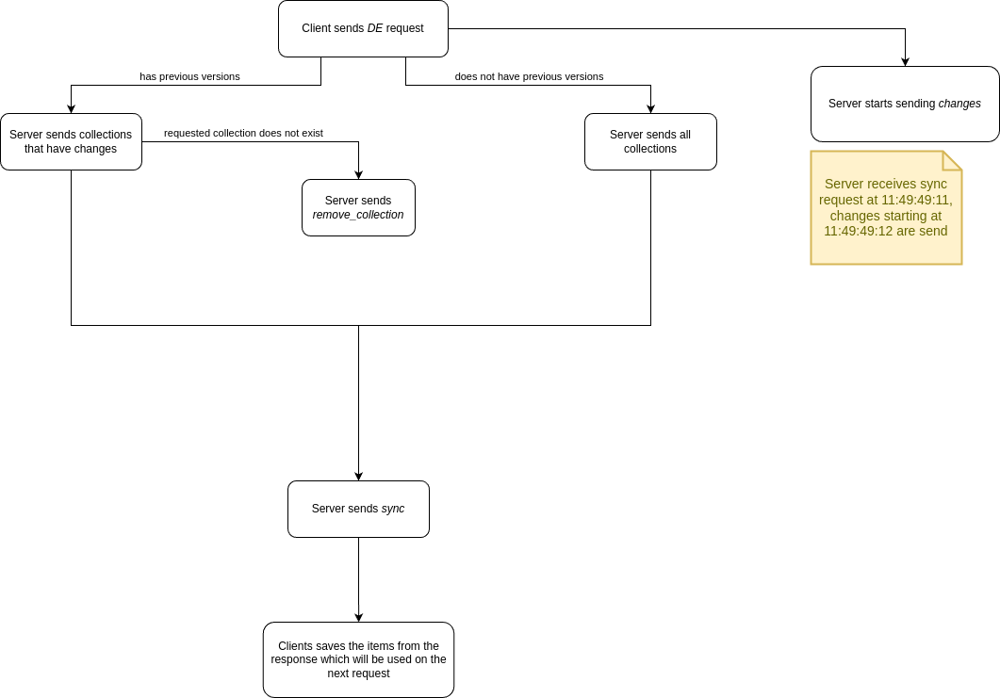

*The primary distinctions between [RPRv2](https://github.com/0xB1a60/rprv2) and RPRvHC lie in the fact that in RPRvHC, the Server (as explained below) is not required to retain access state for each Item. This leads to reduced storage costs and simplifies Server logic. RPRv2 is the recommended choice because of its lighter Client requirements, making it well-suited for slower connections where upload speed is lower than download speed. Additionally, RPRv2 demands lower Server processing needs as data access is already precalculated*

# Realtime Persistent Replication Heavy-Client - RPRvHC
Offline-first Realtime Persistent Replication Protocol

### Legend
1. Client - Web browser, mobile application, or desktop application
2. Server - An application handling all the logic on syncing, prioritizing, and storing data
3. Collection - A group of items of the same type (SQL - table, MongoDB - collection)
4. Item - An entry within a collection (SQL - row, MongoDB - document)

## Motivation
- Most web/mobile/desktop applications today make numerous HTTP fetch calls every time you open them to bootstrap the required data. As the application grows and new features are released, these calls multiply and can reach tens or hundreds
- Classic applications suffer from the 'stale data' problem where the Client (after a fetch) falls out of sync with the Server, potentially leading to Clients making incorrect decisions based on their current view
- Both Clients and Servers consume unnecessary bandwidth since requested data isn't cached, or caching isn't feasible due to frequent changes
- Offline support is absent in most HTTP fetch-based applications, resulting in a poor Client experience with even minor connection drops

## Proposal
- Instead of making tens or hundreds of fetch calls, RPRvHC employs a single HTTP SSE connection for background syncing, delivering the latest changes seamlessly and eliminating the 'stale data' issue
- To fully utilize RPRvHC, web applications can employ IndexedDB, while mobile/desktop applications can use SQLite for persistent storage
- Offline support is inherently provided as data is persistently stored on the Client
- Client engineers are relieved of concerns about API versions, paging, and spinners (except in mutation calls), enabling them to focus on UX development
- The Server can prioritize data transmission (e.g., user details over notifications)
- Since data is stored on the Client, querying and aggregation are instant, reducing Server costs as a bonus

## Design
- The Client is permitted to use only one HTTP SSE connection at a time (e.g., during application bootstrapping). If it fails due to disconnection, connection must be retried until successful completion
- While the Client is syncing, the Server can send the newest _change_ updates. For example, if the Client receives an item with ID "abcd1" and version 100 milliseconds before a change about "abcd1" and version 101 arrives, the Client should ignore the older version 100 and use the item from version 101
- The Client is not allowed to modify persistent data based on its needs (e.g., optimistic UI)
- Syncing can be disconnected at any time from both Server and Client, and the Client is expected to handle this gracefully
- The Server may send the same items that the Client already has. The Client should handle this gracefully
- The Server is recommended to split the *sync* message when its size exceeds 1 MB. For instance, a *sync* message with a size of 2.6 MB would be divided into 3 separate *sync* messages
- Property names from RPRvHC follow snake_case
- Communication between Client and Server is in JSON
- RPRvHC is language-agnostic, not tied to any specific database or programming language

### Query logic change
The distinction between RPRv2 and RPRvHC lies in the fact that the Server doesn't require a static record to monitor whether the Client presently has or has lost access, along with timestamps for such events. 
Consequently, when the query logic undergoes modifications in HC (e.g., the old version only returned products with quantities over 1, while the new version returns all products regardless of quantities), the Client may lag behind in this logic, resulting in outdated data being observed

To address this issue, View Refresh (VR) is to be employed:
- The Server is tasked with monitoring changes in query logic. When such an event occurs, the Server must send a *resync* message through the SSE connection
- When the Client receives the *resync* message, it is required to send a VR request to the Server, and this request must be sent continuously until successful completion
- The Client is obligated to update its persistent storage by either updating existing items or removing those that have been deleted

ex.
1. The Server identifies a change in query logic for *COLLECTION_ABC* through its build pipeline and broadcasts a *resync* message to all clients for *COLLECTION_ABC*
2. The Client, upon receiving the *resync* message for *COLLECTION_ABC*, collects all item IDs and their corresponding versions for *COLLECTION_ABC*, then proceeds to send a VR request
3. The Server responds with the updated/removed items, and the Client is responsible for persisting these changes in its storage

## Communication protocol

### Data exchange (DE)

#### Client request
```json5
{
    // optional, set when the persistent storage contains items
    "items": {
        // key - collection name
        // value - map -> 
                   // key - item id
                   // value - version
        collection_name: {
          item_id: version,
        },
    }
}
```

ex:
```json5
{
    "items": {
        "collection_ABC": {
          "item_id_1": 1692001026,
          "item_id_2": 1692001027,
        },
        "collection_XYZ": {
          "item_id_3": 1692001028,
          "item_id_4": 1692001029,
        },
    }
}
```

#### Server responses as events
```json5
{
    // values: sync, change, remove_collection, resync
    "type": one of values,
    
    "collection_name": string,
    
    ...other properties
}
```

_remove_collection_ is received when the Client has sent a request with the collection under 'items' that does not exist on Server (or the Client has lost access to it)
ex:
```json5
{
    "type": "remove_collection",
    "collection_name": "collection_OLD",
}
```

_change_ is received when an item inside of collection changes
ex:
```json5
{
    "type": "change",
    "collection_name": "collection_ABC",
    
    // values: create, update, remove
    "change_type": one of values,
    
    // unique id for the item
    "id": string,
    
    "version": timestamp as number,
   
    // null when change_type is create
    "before": the previous version of the item, 
    
    // null when change_type is remove
    "after": the current version of the item
}
```

ex:
```json5
{
    "type": "change",
    "collection_name": "collection_ABC",
    "change_type": "create",
    "id": "YHEEW2jMpvezDtNZCA6od",
    "version": 1701284829,
    "before": null,
    "after": {
      "id": "YHEEW2jMpvezDtNZCA6od",
      "created_at": 1701284829,
      "updated_at": 1701284829,
      "value": "chn"
    },
}
```

ex:
```json5
{
    "type": "change",
    "collection_name": "collection_ABC",
    "change_type": "update",
    "id": "YHEEW2jMpvezDtNZCA6od",
    "version": 1701284830,
    "before": {
      "id": "YHEEW2jMpvezDtNZCA6od",
      "created_at": 1701284829,
      "updated_at": 1701284829,
      "value": "chn"
    },
    "after": {
      "id": "YHEEW2jMpvezDtNZCA6od",
      "created_at": 1701284829,
      "updated_at": 1701284830,
      "value": "upt"
    },
}
```

ex:
```json5
{
    "type": "change",
    "collection_name": "collection_ABC",
    "change_type": "remove",
    "id": "YHEEW2jMpvezDtNZCA6od",
    "version": 1701284831,
    "before": {
      "id": "YHEEW2jMpvezDtNZCA6od",
      "created_at": 1701284829,
      "updated_at": 1701284830,
      "value": "upt"
    },
    "after": null,
}
```

```json5
{
    "type": "sync",
    "collection_name": string,

    // optional, value is allowed to be null when there are no values
    // array of items from 'collection_name'
    "values": [{

        // unique id for the item
        "id": string,
        
        "version": timestamp as number,
        
        ...other properties of the item
    }, 
    {...}
    ],
    
    // optional - array of item id
    // ex. permission to an item has changed, item has been deleted
    "removed_ids": [item_id]
}
```

ex:
```json5
{
    "type": "sync",
    "collection_name": "collection_ABC",
    "values": [{
        "id": "1EwArGOcrPf3jxifIMFyx",
        "version": 1692013118,
        "name": "RPR",
        "tags": ["background", "seamless", "sync"],
        "created_on": "Sep 15, 2023"
    },
    {
        "id": "N8CZxDneZjoeRsNJRxxnR",
        "version": 2007632504,
        "name": "RPR 2.0",
        "tags": ["future"],
        "created_on": "Aug 11, 2027"
    }],
    "removed_ids": ["GgFiZqN3SQpy8r9iHo9T8", "5mWL8TlRuqfS9jJDHV1SW"],
}
```

_resync_ is received when the Server has updated its query logic and the Client needs to do a View Refresh (VR)
ex:
```json5
{
    "type": "resync",
    "collection_name": "collection_ABC",
}
```

### View Refresh (VR)

#### Client request
```json5
{
   "collection": string,
   // map - item_id - version, similar to a sync
   "items": {
     item_id: version,
   }
}
```

ex.
```json5
{
  "collection_name": "collection_ABC",
  "items": {
    "1EwArGOcrPf3jxifIMFyx": 1692013119,
    "N8CZxDneZjoeRsNJRxxnR": 2007632505,
  }
}
```

#### Server response
```json5
{
      // optional, value is allowed to be null when there are no values
      // array of items from 'collection_name'
      "values": [{
    
        // unique id for the item
        "id": string,
    
        "version": timestamp as number,
    
        ...other properties of the item
      },
        {...}
      ],
    
      // optional - array of item id
      // ex. permission to an item has changed, item has been deleted
      "removed_ids": [item_id]
}
```

ex:
```json5
{
    "values": [{
        "id": "1EwArGOcrPf3jxifIMFyx",
        "version": 1692013118,
        "name": "RPR",
        "tags": ["background", "seamless", "sync"],
        "created_on": "Sep 15, 2023"
    },
    {
        "id": "N8CZxDneZjoeRsNJRxxnR",
        "version": 2007632504,
        "name": "RPR 2.0",
        "tags": ["future"],
        "created_on": "Aug 11, 2027"
    }],
    "removed_ids": ["GgFiZqN3SQpy8r9iHo9T8", "5mWL8TlRuqfS9jJDHV1SW"],
}
```

###### Diagram


## Implementation suggestions
- While SSE/JSON are not strict requirements, they work across all Clients and are simple to use. However, any transport/serialization protocol can be utilized
- When sending mutation calls, design the API to include the version of the item you're modifying (when applicable) to ensure data integrity
- For change responses, utilize the CDC (Change Data Capture) provided by the database (e.g., Data Change Notification Callbacks for SQLite, Change Streams for MongoDB, Change Data Capture/Listen-Notify for CockroachDB), rather than managing it in the code, to minimize engineering overhead

## Async transport not available
If the async transport (WS/SSE) is unavailable, the Server can fallback to a request-only endpoint. In this scenario, the Client would pull data at regular intervals, with the optimal frequency determined by the Server itself. It's important to note that this fallback mechanism sacrifices the ~~Realtime~~ Persistent Replication aspect originally provided by RPR

## Extensions suggestions
* Item integrity verifier - Since data is stored on the Client, data corruption could occur due to accidental writes or platform purging. The Client could send a verify request with each item ID and a checksum of the content. The Server can then respond accordingly
